# LogisticsLink - 비즈니스 플로우 한눈에 보기

> **본 문서**: `docs/BUSINESS_FLOW.md` (v2.0)의 **요약 + 시각적 다이어그램** 모음.
> 의사결정자·신규 합류자·세일즈가 빠르게 이해하도록 작성.

---

## 1. 비즈니스 한 줄 요약

```
산업군·물성·구간별로 화주 수요를 묶고 → 블라인드 역경매로 선사/포워더에 낙찰
```

---

## 2. 핵심 5대 비즈니스 룰

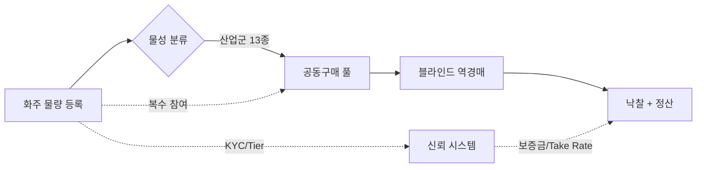

| 룰 | 내용 |
|----|------|
| **R1. 물성 단위 분리** | 산업군·세부물성이 다른 화물은 절대 섞이지 않음 (배터리 ≠ 전자 ≠ 화학) |
| **R2. 블라인드 역경매** | 선사는 총량·구간·물성·스케줄만 보고 응찰, 화주 신원은 낙찰 후 공개 |
| **R3. 복수 참여** | 한 화주가 동일 산업군·구간의 ETD 다른 여러 풀에 동시 참여 가능 (단, 동일 풀 중복만 차단) |
| **R4. Take Rate** | 화주 2~4% + 선사 구독료·거래 수수료 + 부가서비스 + FX 스프레드 |
| **R5. KYC + Trust + 보증금** | 3단계 KYC + 이벤트 기반 Trust Score + 임계값별 보증금 차등 |

---

## 3. 산업군 분류 (R1)

13개 산업군 × 세부물성으로 2단계 분류:

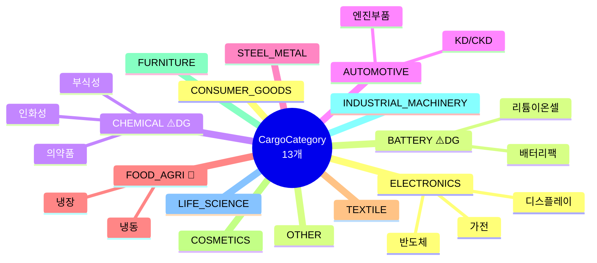

**산업군별 풀 격리 원칙**:
- ⚠️ 위험물 풀(`isHazardous=true`)은 비위험물 풀과 절대 합쳐지지 않음
- 🧊 냉장 vs 냉동은 별도 풀
- 같은 산업군이라도 세부물성이 다르면 별도 풀 (모수 부족 시 운영자 승인 하에 합병 가능)

---

## 4. 공동구매 풀 라이프사이클

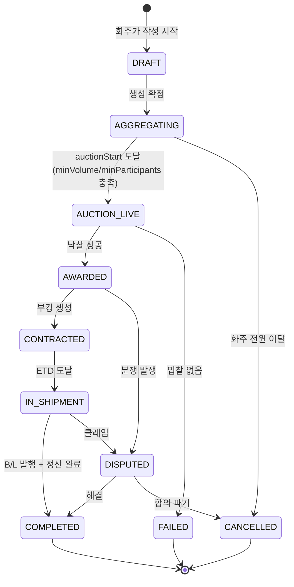

**풀 임계치 (Threshold)**:
- `minVolumeTeu`: 기본 4 TEU
- `minParticipants`: 기본 2사
- 미달 시: 자동 연장(+7일) / 단독 견적 전환 / 운영자 폐기

---

## 5. 사용자 여정 (User Journey)

### 5.1 화주

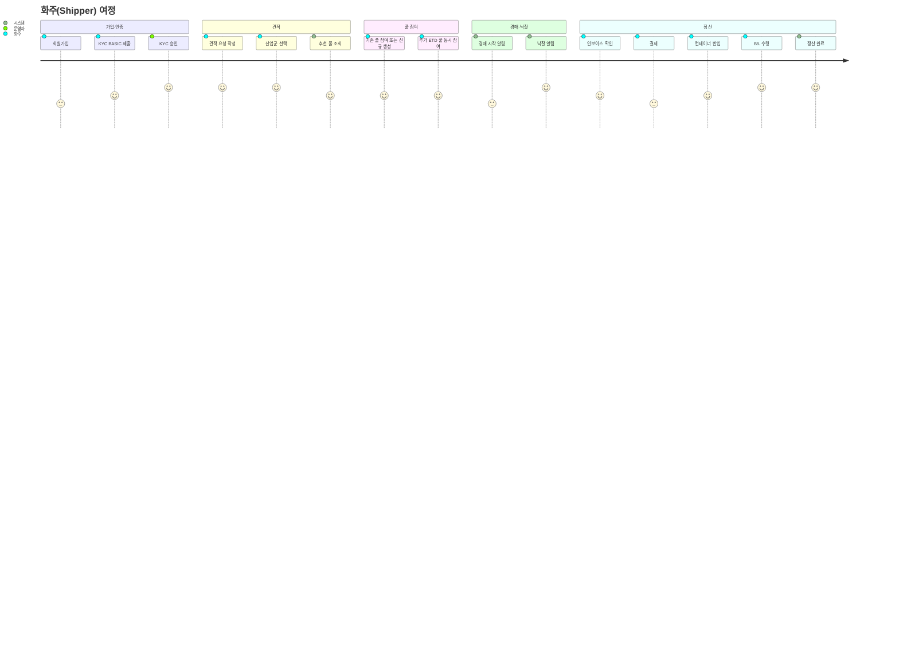

### 5.2 선사

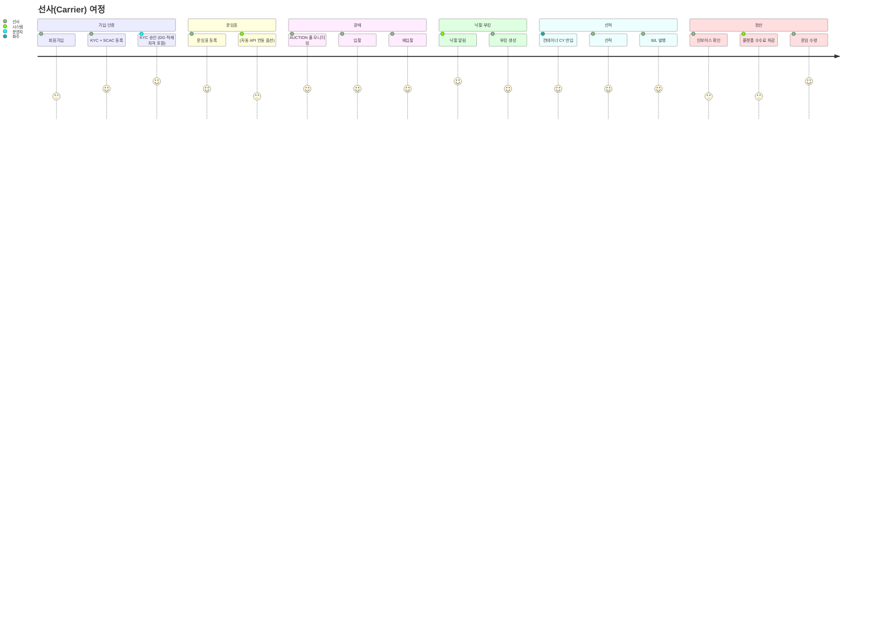

---

## 6. 매칭 알고리즘

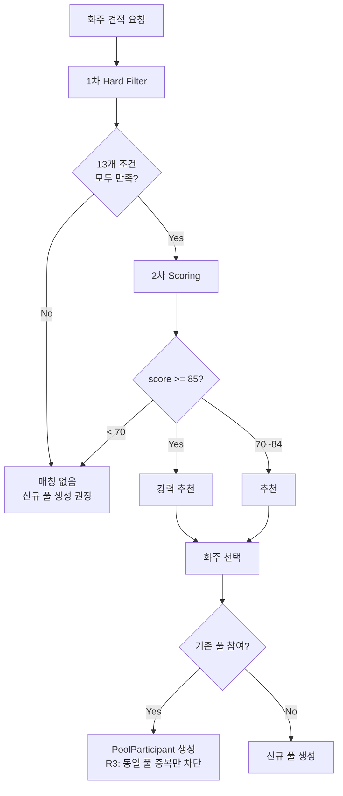

**1차 필터 (Hard)**:
- `cargoCategory` 일치 (R1-A)
- POL/POD 일치
- ETD 차이 ≤ 3일
- `isHazardous/isReefer/isHeavy` 일치
- `containerType` 일치

**2차 스코어 (Soft)**:
- 구간 일치 30점
- ETD 차이 (0일 20점 ~ 3일 5점)
- 세부물성 일치 15점
- 컨테이너 일치 10점
- 물량 효율 10점
- Trust Score 90+ 5점
- KYC VERIFIED 5점

---

## 7. 역경매 메커니즘

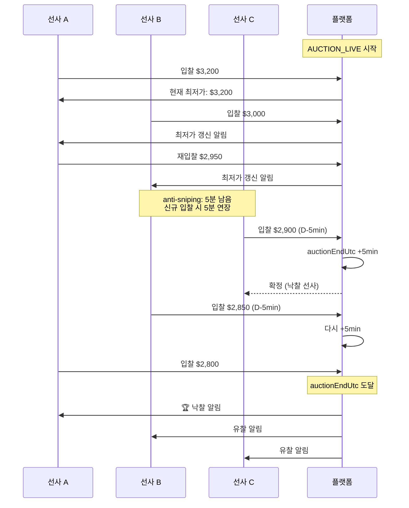

**Anti-Sniping 룰**:
- 종료 5분 전 신규 입찰 발생 시 `auctionEndUtc`를 +5분 연장
- `extensionCount` 증가 (최대 3회)
- `PoolExtension` 테이블에 로그 기록

---

## 8. 수익 모델 (R4) 시각화

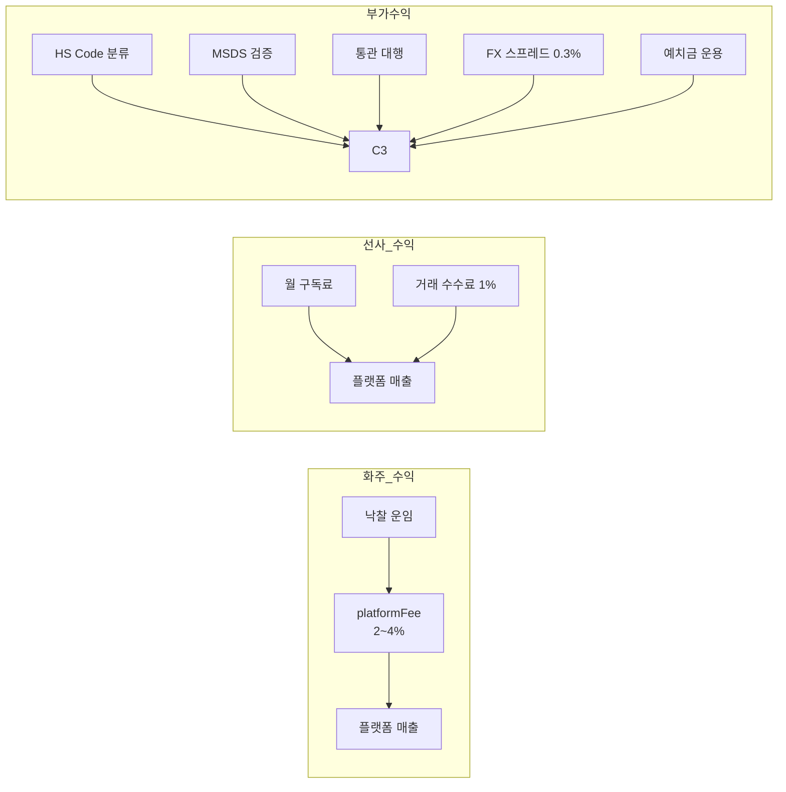

**Take Rate 티어 구조**:

| 화주 KYC | takeRateBps | 실수익률 |
|----------|-------------|----------|
| BASIC | 400 | 4.0% |
| VERIFIED | 300 | 3.0% |
| PREMIUM | 200 | 2.0% |

| 선사 플랜 | 월 구독료 | 거래 수수료 |
|----------|----------|------------|
| Standard | ₩300,000 | 1.0% |
| Premium | ₩1,500,000 | 1.0% (우선 매칭) |
| Enterprise | 별도 계약 | 별도 |

---

## 9. Trust Score 시스템

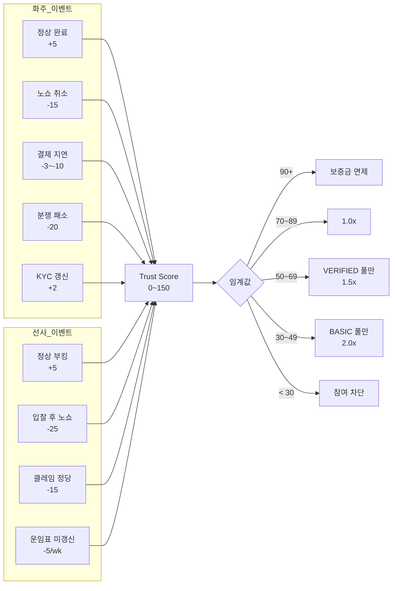

---

## 10. 정산 흐름 (D+N 타임라인)

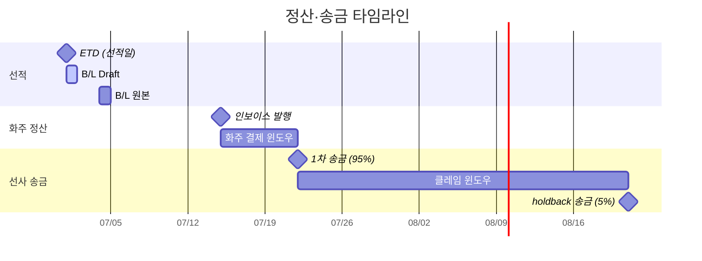

**인보이스 구성** (확장):
```
[1] Base Freight         (낙찰 운임)
[2] THC                  (터미널)
[3] BAF                  (연료할증)
[4] CAF                  (환율할증)
[5] Doc Fee              (서류)
[6] Insurance            (보험)
[7] Platform Fee         ← R4: takeRateBps
[8] VAT                  ([1]~[7]의 10%)
─────────────────────
Subtotal (USD) → FX → Total (KRW)
```

---

## 11. 산업군별 특화 룰 요약

| 산업군 | 강제 컨테이너 | 위험물 | 특화 서류 | 추가 takeRate |
|--------|--------------|--------|----------|---------------|
| **BATTERY** | DANGEROUS | Class 9 | MSDS, UN38.3 | +50 bps |
| **CHEMICAL** | TANKER | Class 3/6/8 | MSDS, REACH | +50 bps |
| **FOOD_AGRI** | REEFER 강제 | - | 위생증, 검역증 | - |
| **ELECTRONICS** | DRY | - | RoHS, KC | - |
| **AUTOMOTIVE** | DRY/HC | - | 원산지증명 | - |
| **STEEL_METAL** | DRY/HC (heavy) | - | - | - |
| **TEXTILE** | DRY | - | 원산지증명 | - |
| **LIFE_SCIENCE** | DRY/REEFER | - | 의약품 수출허가 | - |

---

## 12. 기존 MVP → v2.0 핵심 차이

| 영역 | MVP (v1) | Business v2.0 |
|------|----------|---------------|
| **물성 분류** | `cargoType` (단순 String) | `cargoCategory` 13종 + `cargoSubType` |
| **매칭 키** | cargoType + container | cargoCategory + 구간 + ETD + 특수취급 |
| **복수 참여** | 사실상 가능 | **명문화 + UI 분리** |
| **화주 인증** | 단순 ACTIVE | **KYC Tier 3단계** |
| **신뢰** | score 1컬럼 | **이벤트 로그 + 임계값 룰** |
| **수익** | 미정 | **Take Rate + 구독료 + 부가서비스** |
| **정산** | 미구현 | **Invoice + 부대비용 + FX Buffer** |
| **경매** | 공개 하락 고정 | **3가지 포맷 + Anti-Sniping** |
| **임계치** | 없음 | **minParticipants/minVolumeTeu** |
| **산업군 룰** | 없음 | **배터리·화학·식품·전자 특화** |

---

## 13. KPI 대시보드 (Top 5)

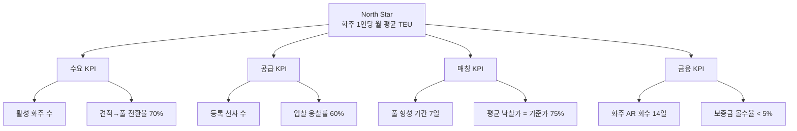

| KPI | 1년 차 목표 |
|-----|-----------|
| 활성 화주 수 | 500사 |
| 등록 선사 수 | 30사 |
| 월 낙찰 풀 수 | 100건 |
| 평균 낙찰 할인율 | 25% (낙찰가 = 기준가의 75%) |
| 화주 NPS | 50+ |
| 월 매출 (takeRate 기준) | ₩50M+ |

---

## 14. 다음 단계

상세 비즈니스 룰, 도메인 모델, API 명세는 모두 [`docs/BUSINESS_FLOW.md`](./BUSINESS_FLOW.md) 참조.

본 요약 문서를 보고 다음 중 선택해 주세요:

1. **데이터베이스 스키마 마이그레이션** — `prisma/schema.prisma`에 신규 엔터티 추가
2. **API v2 설계** — 새로운 엔드포인트 명세 작성
3. **화주 UI 프로토타입** — 산업군 선택 → 풀 추천 → 복수 참여 UX
4. **KYC 워크플로우** — KycProfile + 문서 업로드 + Admin 검토 화면
5. **정산 엔진** — Invoice 생성 + 부대비용 배부 로직
6. **다른 룰 검토** — R1~R5 외에 추가/수정할 룰이 있다면 논의

---
